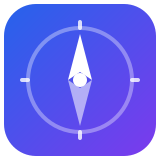
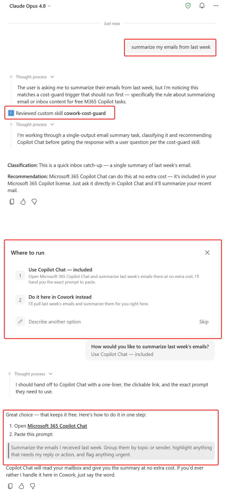
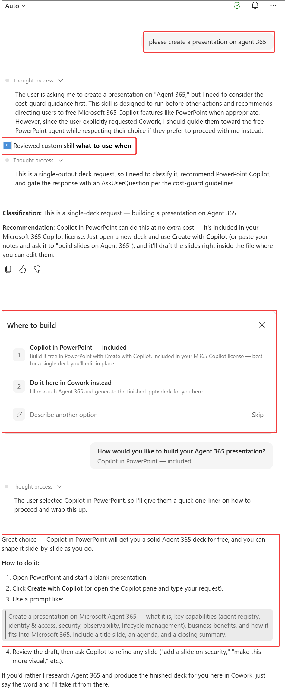
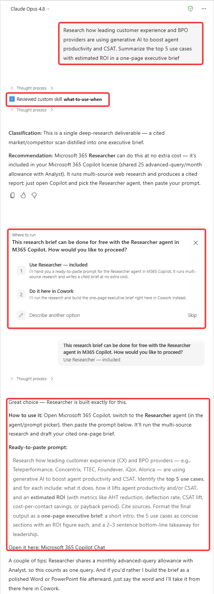

  

<h1 align="center">What to Use When</h1>

  <strong>A Microsoft 365 Copilot Cowork skill that points you to the right Microsoft AI tool for each task —
  and only uses Cowork when it's genuinely the best fit.</strong>

---

## 🚀 Minimal path to awesome

1. **Get the skill file:** [**Download "What to Use When"**](What-to-Use-When.md)
2. **Add it to Cowork:** from within Microsoft 365 Copilot **Cowork**, add a skill and upload the file.
3. **Try it:** ask Cowork *"summarize my Teams messages from the last 5 weeks."* The skill points you to the free tool that can do it — and asks before using any Cowork consumption.

That's it — you're set. 🎉

---

## What it does

Microsoft 365 Copilot **Cowork** runs on usage-based consumption. Many everyday tasks are already covered — at no extra cost — by capabilities included in your Microsoft 365 Copilot license.

**What to Use When** quietly checks each request *before* Cowork starts working. When a free tool can do the job, it points you there:

| When you want to… | It points you to… |
|---|---|
| Ask a quick question, or summarize email / meetings / Teams | **Microsoft 365 Copilot Chat** |
| Create or edit **one** document, workbook, or deck | **Copilot in Word / Excel / PowerPoint** |
| Do deep, cited research | **Researcher** |
| Analyze a dataset | **Analyst** |
| Run a genuine multi-step job with several finished deliverables | **Cowork** (it steps aside and lets you go) |

Then it asks you to confirm — so you're always in control, and you learn which tool to reach for next time.

---

## See it in action

**Summarizing email — pointed to Copilot Chat**

**Creating a deck — pointed to Copilot in PowerPoint**

**Researching a topic — pointed to Researcher**

---

## Deploy it across your organization

Share it once and it installs for your users as a **plugin** — no manual setup on their end. Microsoft's guides walk through it:

- **Use plugins with Copilot Cowork** — https://learn.microsoft.com/en-us/microsoft-365/copilot/cowork/cowork-plugins
- **Manage agents in the Microsoft 365 admin center** — https://learn.microsoft.com/en-us/microsoft-365/admin/manage/manage-copilot-agents-integrated-apps

---

## Reports

The [`reports/`](reports/) folder holds the skill's validation and test results — quality score, trigger reliability, and more. They're HTML files, so to see them **rendered** (not as code), open one through a preview service — `https://htmlpreview.github.io/?` followed by the file's GitHub link — or turn on **GitHub Pages** for the repo.

---

## Disclaimer

This is a **community skill**, not an official Microsoft product, and it comes with no warranty. It's a guidance aid — not a billing or spending control. Microsoft product names, capabilities, license entitlements, and Cowork consumption are **subject to change**, so verify the current details for your tenant against official Microsoft documentation, and confirm your organization's licensing before relying on any routing recommendation.

